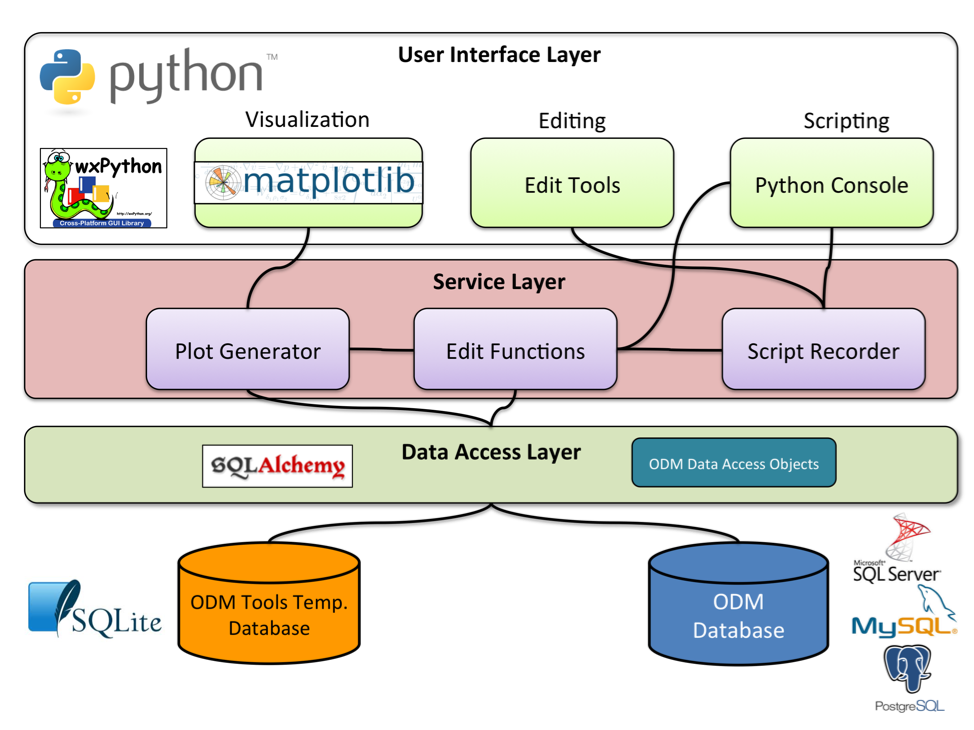

#Architecture#

ODM Tools Python software was developed in Python as a desktop program with a GUI. It is a client application for a local or remote ODM database implemented within a RDBMS. Time series data are retrieved from an ODM database into local memory for data visualization and editing within ODM Tools and then the results can be saved back to the ODM database. The architecture of the ODM Tools Python software consists of four layers, shown below. 

##Data Storage Layer##
 An ODM database implemented within a RDBMS is the underlying data storage mechanism that provides a convenient and robust structure within which to store, manage, and manipulate sensor data. User access control for ODM databases is handled by the RDBMS within which they are deployed. Using ODM Tools Python requires users to have an appropriate user account to access an ODM database.

##Data Access Layer##
ODM Tools Python uses a SQLAlchemy-based data access layer (http://www.sqlalchemy.org/) to abstract data from the ODM database. It also provides a set of programmable objects that facilitate data management within the program as an alternative to repeatedly programming Structured Query Language (SQL) queries directly against the ODM database. The data access layer also provides support for connections to ODM databases within multiple RDBMS (currently Microsoft SQL Server, MySQL, and PostgreSQL). SQLite is also used as an in-memory database to temporarily store and manipulate time series data objects during data editing sessions. SQLite is a software library that implements a file-based, serverless, transactional SQL database engine (http://www.sqlite.org). 

##Service Layer##
The service layer consists of a set of Python-based services containing the core functionality of the program. A service is an object that creates and receives data objects defined in the data access layer, and the GUI interacts with the data access layer through the service layer. For example, a Plot Generator service provides functions for creating the visualizations within the GUI, the Edit Functions service provides functions for performing data quality control editing on time series data, and the Script Recorder service manages the automated recording of Python function calls during data editing sessions. The Edit Functions service was designed as a Python module that is installed automatically on a user’s computer with the ODM Tools Python software deployment. It serves as the underlying code for the data editing tools on the ODM Tools Python editing toolbar, and, because it is independent of the ODM Tools Python GUI, it can be added to and used within any Python script.

##User Interface Layer##
The user interface layer provides the GUI within which users can visualize and export data, generate summary statistics, and perform data quality control editing. The GUI is designed and implemented using wxPython (http://www.wxpython.org/), a toolkit for Python that provides programmers with components for building interactive GUIs. The matplotlib plotting library (http://matplotlib.org/) is used for creating the data visualizations and provides interactive zooming and panning of the plot. We added customized mouse hover functionality to display data values and a plot-based data selection tool to aid in data editing. The user interface layer also includes an integrated Python script editor and console that were implemented using the PyCrust component of wxPython. 