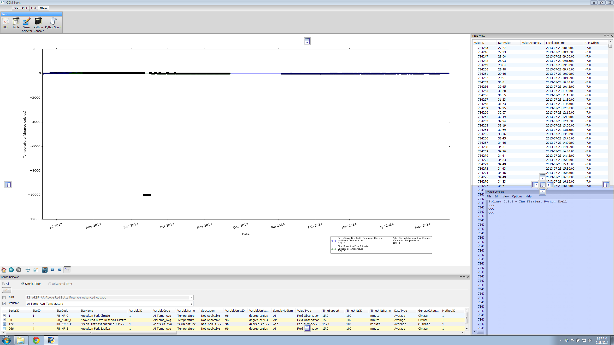
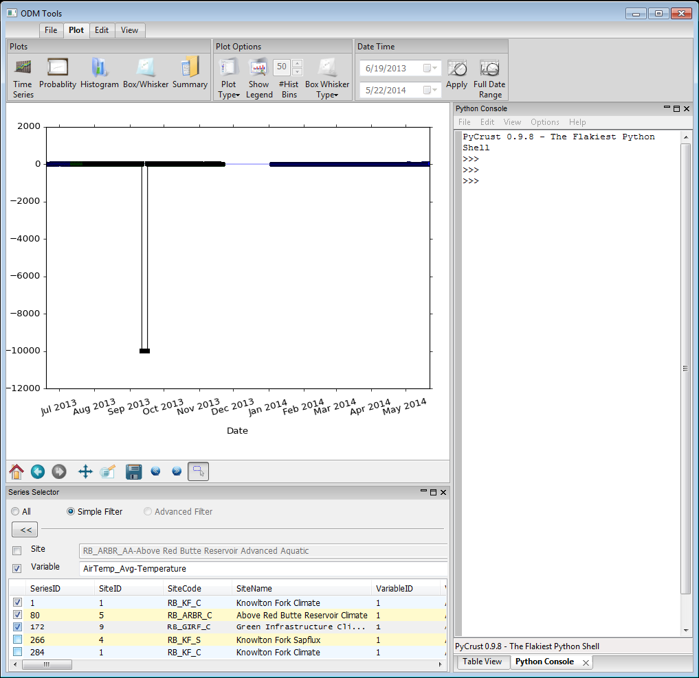

#Dockable Windows#

The ODM Tools Python application consists of several windows that can be docked within the interface or can be floating. The windows are accessed on the 'View' tab. The Plot and Series Selector windows are shown by default. 

The Plot window is the central, anchor window of the program. Around the plot window, there are multiple docking areas to which other windows can be moved, permitting a variety of viewing configurations. Windows are moved by clicking on the header of the window and dragging it to another part of the screen. When a window is drug, the dockable areas of the screen are shown. Windows can be docked to any side (top, bottom, right, left) of the central plot window or of any other visible window. Windows can also be docked centrally with each other, which enables tabbed viewing. Windows can also be left floating by dragging and not attaching to a dock.

  
  

Windows can be toggled on/off by using the corresponding button in the ribbon. Note that the Plot window can be hidden, but no other window can fill its space. Windows can also be minimized, maximized, or closed by using the icons in the right of the window header.

The Plot and Series Selector windows are displayed by default and are the only windows necessary for visualizing data. The Table, Python Script, and Python Console windows are useful when editing data. The Table shows the data values for a series that is being edited, and it can be used to select data points. The Python Script window shows the steps in the editing process when edits are being recorded and can be used to load saved scripts. The Python Console window permits the creation and execution of custom edits.