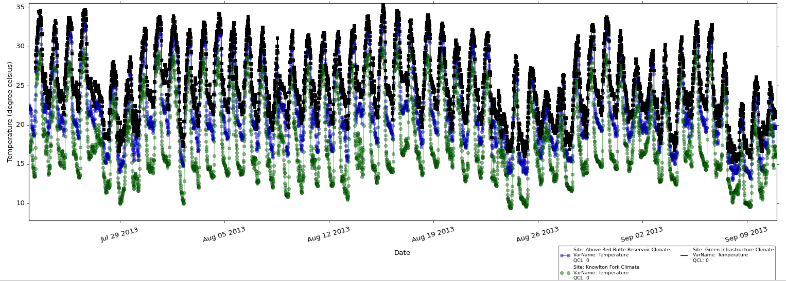
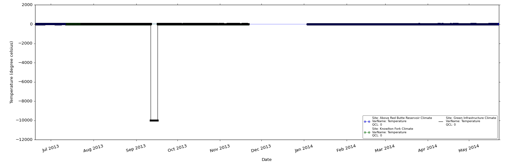

#Editing Data Series#

ODM Tools Python includes functionality to edit data values, add qualifiers to data values, derive new data series, and save edits to data series stored within an ODM database. Data editing is important for performing quality control and post processing on data series where some data values may need to be deleted, adjusted, or interpolated. Deriving data series is useful for aggregating data (e.g., daily average derived from high frequency measurements) or generating a data series that is a function of one or more other data series (e.g., discharge as a function of stage). Currently the functionality to derive new data series is not built into ODMTools Python.

##Selecting Series for Editing##

The 'Edit' tab is used to perform edits on data series. The visualizations that are created in the 'View' tab will carry over to the 'Edit' tab, and the Series Selector is used to show/hide data series in the plot. This way, multiple data series can still be viewed while edits are made. Only one data series can be edited at a time. To select a series for editing, the series of interest should be the highlighted in the Series Selector. Click on the 'Edit Series' button in the ribbon to begin editing. When a series is in editing mode, a few aspects of the plot change:

   1. The symbology of the series of interest changes from the plot type and color selected in the 'Plot' tab to black squares and lines. The symbology of any additional displayed series are made more subtle. 

   1. The 'No Data' values that were previously hidden are now be plotted. This will often change the zoom level on the plot since large, negative numbers are typically used to indicate 'No Data' (e.g., -9999). 

   1. If the series selected for editing was not plotted previously, it will automatically be plotted.

##Scripting Edits with Python##

A powerful capability of ODM Tools Python is the functionality to record the steps performed to edit a data series. This is accomplished by scripting in Python. When a user chooses to record edits, all actions taken are recorded as lines of code in the Python script editor. The script can then be saved for later execution and review. There are several benefits to this practice. Most importantly, it fosters traceability and transparency in the editing process as information regarding the editor, date of editing, and specific functions performed are all retained. In addition to recording the editing steps, the user can add comments to the script to annotate the rationale for edits. The scripting functionality also makes edits reproducible, which adds flexibility to the post-processing workflow. The editing of a data series can be performed in multiple sessions with the script incrementally saved and re-run for each new session. A script could be generated by one user and then reviewed and revised by another user before implementation.

In order to record edits, when editing is active, click on the 'Record' button in the Ribbon. Viewing the Script Editor window is helpful during this process. When the 'Record' button is activated, information on the database connection and data series of interest will automatically be written to the Script Editor. Every time points are selected and tasks are performed, the steps will be added as lines of code to the script editor. The user can also add comments, which should be done by adding # to the front of each line.

Note that the credentials of the database connection will be displayed here. The user can edit the script to delete usernames and passwords. 