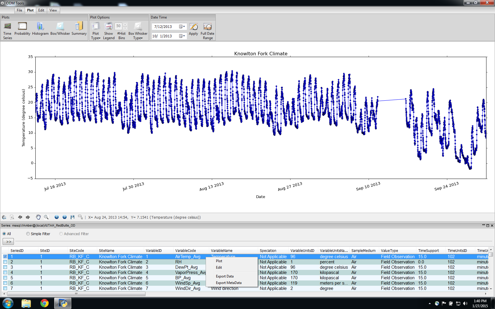

#Export#

ODM Tools Python can be used to access and export data and associated metadata. This is performed simply by right clicking on a data series in the Series Selector and selecting 'Export' as shown below. In a similar manner, metadata for the entire series may be exported to an XML file for reference.

A dialog will then prompt for a location for saving the data series locally. The data is exported as a CSV file. Each data point is represented by a single line in the CSV file and includes fairly complete metadata by way of the columns in the file. Exported columns are: 
-SeriesId  
-ValueId  
-DataValue  
-ValueAccuracy  
-LocalDateTime  
-UTCOffset  
-DateTimeUTC  
-SiteCode  
-SiteName  
-SiteType  
-Latitude  
-Longitude  
-SRSName  
-VariableCode  
-VariableName  
-Speciation  
-VariableUnitsName  
-VariableUnitsAbbreviation  
-SampleMedium,OffsetValue  
-OffsetTypeID,OffsetDescription  
-OffsetUnitsName,CensorCode  
-QualifierID,QualifierCode  
-QualifierDescription  
-Organization  
-SourceDescription  
-Citation  
-QualityControlLevelCode  
-Definition  
-Explanation  
-SampleID

