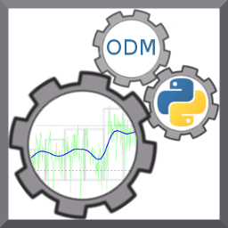

#Introduction 

It is common for in situ hydrologic and water quality data to be collected at high frequencies and for extended durations. These data streams, which may also be collected across many monitoring sites require infrastructure for data storage and management. The Observations Data Model (ODM), which is part of the Consortium of Universities for the Advancement of Hydrologic Science, Inc. (CUAHSI) Hydrologic Information System (HIS), was developed as a standard data model in which to organize, store, and describe point observations data (http://his.cuahsi.org/odmdatabases.html). ODM Tools Python is an open source software application that allows users to query and export, visualize, and perform quality control editing on time series of environmental observations data stored in an ODM database. Previous versions of ODM Tools (http://his.cuahsi.org/odmtools.html) included functionality to export data series and associated metadata, plot and summarize a single data series, generate derivative data series, and edit data series using a set of simple tools. This newer version of ODM Tools in Python adds a more complete quality control editing workflow, a modernized graphical user interface, multiple platform support (Windows, Linux, and Mac), multiple database support (Microsoft SQL Server, MySQL, PostgreSQL), and automated scripting of quality control edits through a Python script editor and console integrated with ODM Tools’ Graphical User Interface. Automated scripting records the corrections and adjustments made to data series in the quality control process, ensuring that the steps are traceable and reproducible.
