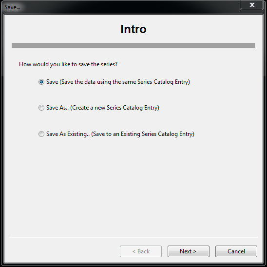

#Saving Edits to Data Series#

ODM Tools Python stores all edits in memory until the user commits them to the database. Edits can be saved as a new data series, which retains the base data series on which edits were made. This is important when performing quality control post processing on raw sensor data. The raw data should not be overwritten, but should be saved as a higher level data product (i.e., quality control level 1). This is also useful for deriving new data products from existing series (e.g., discharge derived from stage). Alternatively, edits can be saved to the same data series for cases when editing a data series is performed in multiple sessions. The edits made in the first session would be saved as a new data series and future sessions would work off of that existing series.

 To save the edits made to the database, click on the 'Save' button in the ribbon, which will initiate the Save dialog. Choose the appropriate radio button:  
 1. 'Save' saves edits to and overwrites the existing data series.  
 2. 'Save As' creates a new data series to which edits are saved.  
 3. 'Save As Existing' saves edits to an existing series, but not the series that is being edited. This option is selected when perform edits in multiple sessions and needing to save to an existing quality controlled version.

##Save##
 If 'Save' is selected, a summary of the series metadata will be shown. Clicking 'Finish' will prompt several times to verify that the series should actually be overwritten.

##Save As##
 If 'Save As' is selected, the Save dialog will prompt the user to define metadata information for the data series. Existing information from the database can be used or new entries can be created for the data series being saved.
 -*Method:* There are three options: the program can automatically generate a method, an existing method can be used, or a new method can be created. For an existing method, select an entry from the database. For a new method, type a description in the text box.

 -*Quality Control Level:* An existing quality control level can be selected or a new one can be created. Choose an existing quality control level from the table, or enter a Code, Definition, and Explanation for a new quality control level.

 -*Variable:* Options are to use the current variable, select an existing variable form the database, or create a new variable. For an existing variable, select from the table. Selecting the radio button to create a new variable will bring up a form for entering the necessary variable attribute information. Currently, this form is not fully functional.

 

 After completing the information for all of these metadata entries, the Save dialog will display a summary for review before the series is saved. 

##Save As Existing##
If 'Save As Existing' is selected, the Save dialog will prompt the user to select the data series to which the edits will be saved. A list of all series at the Site of the current series will be presented for selection. Note that the selected series will be overwritten by the series being edited.

After a series is selected, the Save dialog will display a summary for review prior to saving. The dialog will also notify and verify that the series will be overwritten.