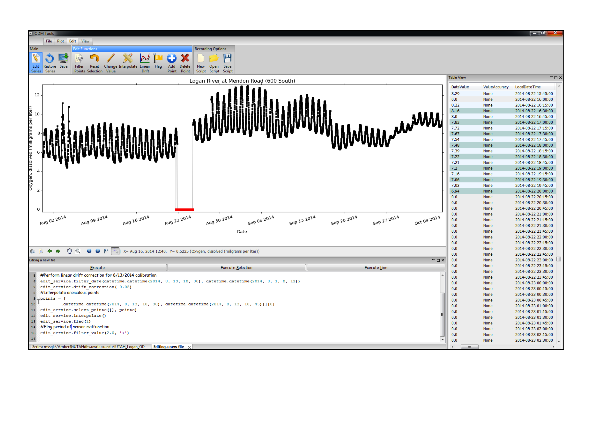

#Scripting Edits with Python#

A powerful capability of ODM Tools Python is the functionality to record the steps performed to edit a data series. This is accomplished by scripting in Python. All actions taken in editing mode are recorded as lines of code in the Python script editor. The script can then be saved for later execution and review. There are several benefits to this practice. Most importantly, it fosters traceability and transparency in the editing process as information regarding the editor, date of editing, and specific functions performed are all retained. In addition to recording the editing steps, the user can add comments to the script to annotate the rationale for edits. The scripting functionality also makes edits reproducible, which adds flexibility to the post-processing workflow. The editing of a data series can be performed in multiple sessions with the script incrementally saved and re-run for each new session. A script could be generated by one user and then reviewed and revised by another user before implementation.

When editing is active, all editing steps are automatically recorded. Every time points are selected and tasks are performed, the steps are added as lines of code to the script editor. The user can also add comments, which should be done by adding # to the front of each line. Viewing the Script Editor window is helpful during this process. Options for scripting are:  
1. Record without starting a new script. This records all of the edits, but does not associate them with a database or a series. This is typically only done with testing.  
2. Start a new script. This records all edits to a new scripts and adds the file header to associate the edits with a database and a data series.  
3. Open an existing script: This brings up a dialog to open a previously saved script, which can then be edited, exectued, and appended with any new edits performed. 

Note that the credentials of the database connection will be displayed here. The user can edit the script to delete usernames and passwords. The screenshot below shows the program duing an editing session with code and annotations being recorded in the script editor.

