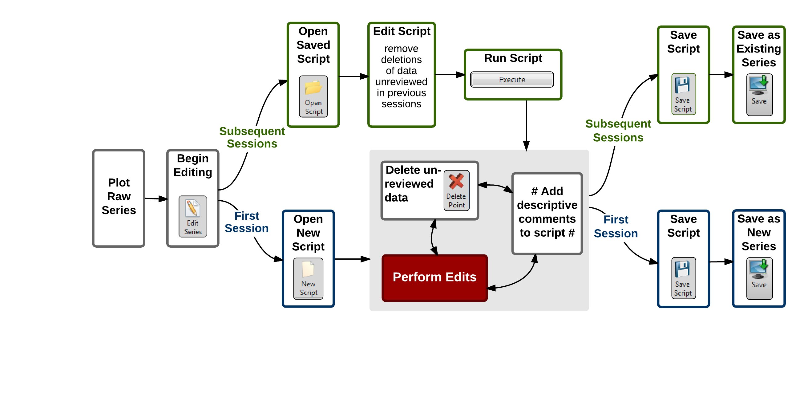

#Quality Control Workflow#
Quality control of continuous sensor datasets is often an ongoing process. Some data collection efforts may continue for months or years, and it is not always feasible to wait until the end of data collection activities to perform quality control to produce finalized versions of collected data for use in scientific analyses. Furthermore, quality control activities typically lag behind the collection of data as scientists need time to review data within the context of environmental conditions. Because of these disparities in timeframe between raw and quality controlled data, a quality control editing workflow is needed that supports creation of quality controlled versions of the data while data collection activities continue. The below figure shows the data quality control workflow that we have developed and implemented using ODM Tools Python. The associated buttons in the program are included in each step.

##Initial Editing Session##
To begin the workflow, select a raw time series for editing and plot the data. Then, click on 'Edit' to put the series into editing mode, which makes a copy of the series in memory on which edits are performed. If editing a time series for the first time, click on 'Create New' script to begin recording data edits performed within the editing session. Edits are then performed, each of which is recorded as one or more lines of code in the script. Descriptive comments should be added to the script to provide rationale and annotations. At the end of the editing session, any unreviewed data is deleted from the time series (e.g., the full series of the raw data record is not completed during the editing session). The script should then be saved locally by clicking on the 'Save Script' button. Finally, the 'Save' button and Save dialog are used to save the edited data series back to the database as a new, quality controlled version of the data. 

##Subsequent Editing Sessions##
Subsequent editing sessions are necessary when new raw data are added to a previously edited time series or to complete quality control editing for a partially reviewed time series. Similar to the first session, select the raw time series for plotting and begin an editing session. Instead of creating a new script, open the script saved from the previous editing session using the 'Open Script' button. Remove any lines that deleted unreviewed data, and then use the 'Execute' button to run the script on the raw data. The result is a memory copy of the time series that contains quality controlled data up to the point left off during the previous editing session.Any new/unreviewed raw data are appended. Additional edits are performed as needed with descriptive comments added and unreviewed data deleted similar to the first editing session. These steps are appended to the original script. At the end of the editing session, save the modified script locally and then use the 'Save As Existing' option of the Save dialog to save the edited series back to the database as the previously quality controlled data series. 
